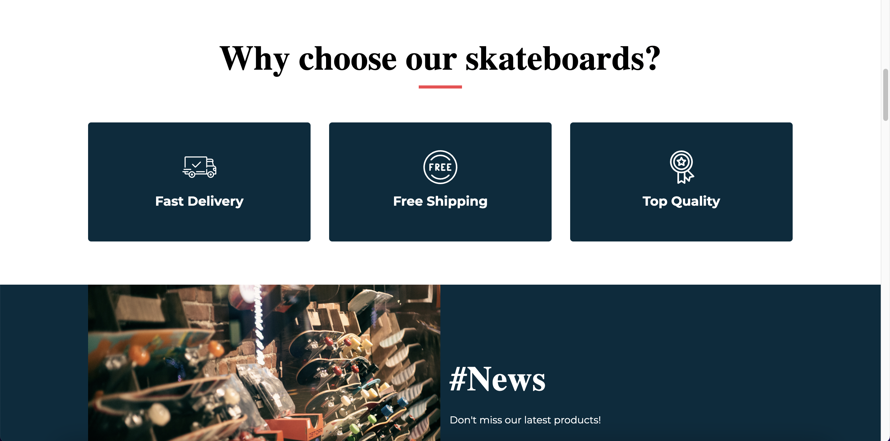
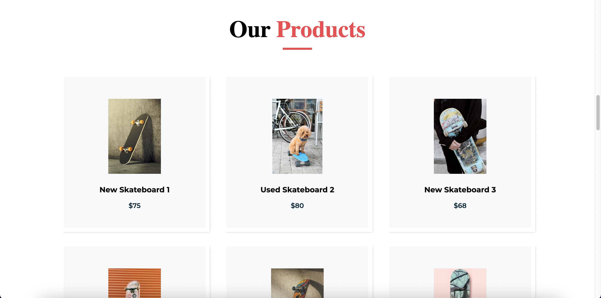
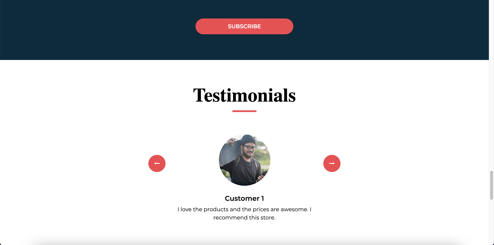

# ScrapePark.org

Welcome to [ScrapePark.org](https://scrapepark.org/), your "web scraping park". 

Apply your web scraping knowledge and skills in this website specially designed for this purpose and practice safely without affecting third-party platforms, websites, or services. 

## Elements

**ScrapePark.org** includes elements to help you practice web scraping, including a table, an iframe, dropdown menus, links, lists, images, buttons, forms, a carousel, menu items, navigation bar items, and more.

These are some sample screenshots:

-----

-----

-----

-----

## freeCodeCamp.org

This website is hosted by [freeCodeCamp.org](https://www.freecodecamp.org/), a friendly community where you can learn to code for free. It is run by a donor-supported 501(c)(3) nonprofit to help millions of busy adults transition into tech. Our community has already helped more than 40,000 people get their first developer job.

Our full-stack web development and machine learning curriculum is completely free and self-paced. We have thousands of interactive coding challenges to help you expand your skills.

## Contributing

Thank you for your interest in contributing to ScrapePark.org. We welcome your contributions to expand the website. 

#### Commits and Pull Requests

We recommend using [conventional title and messages](https://www.conventionalcommits.org/en/v1.0.0/) for commits and pull requests. 

Please keep the description short (less than 30 characters) and simple; you can add more information in the PR description box and comments. 

Read our guidelines to [open a pull request](https://contribute.freecodecamp.org/#/how-to-open-a-pull-request). 

## Courses

The `courses` directory of this repository has versions of this website that have been used in video courses created for freeCodeCamp. 

These versions **will not accept any pull requests** because learners need to see the same results to follow the courses step by step.

## Copyright and Attribution

This website was created from a template in [Free Html Templates](https://html.design/).

* **Gustavo Juantorena** - Spanish translation and template modification.
* **Estefania Cassingena Navone** - Skateboard shop theme and template modification.

## License

Copyright © 2022 freeCodeCamp.org